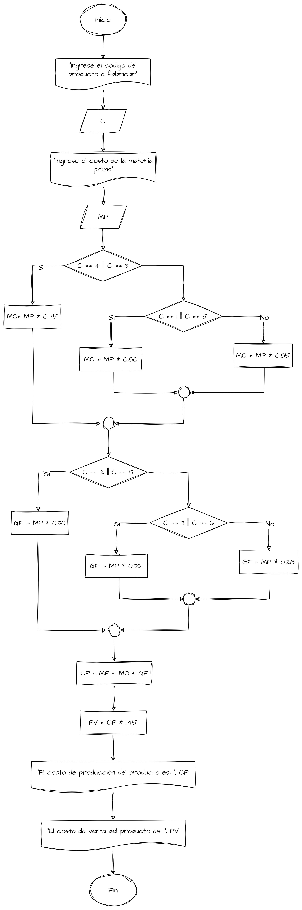

# Ejemplo de uso de Condicionales

## El Problema

Fábricas “El cometa” produce artículos con claves (1, 2, 3, 4, 5 y 6). Se requiere un algoritmo para calcular los
precios de venta, para esto hay que considerar lo siguiente:

* Costo de producción = materia prima + mano de obra + gastos de fabricación.
* Precio de venta = costo de producción + 45 % de costo de producción.

El costo de la mano de obra se obtiene de la siguiente forma: para los productos con clave 3 o 4 se carga 75 % del costo
de la materia prima; para los que tienen clave 1 y 5 se carga 80 %, y para los que tienen clave 2 o 6, 85 %.

Para calcular el gasto de fabricación se considera que si el artículo que se va a producir tiene claves 2 o 5, este
gasto representa 30 % sobre el costo de la materia prima; si las claves son 3 o 6, representa 35 %; si las claves son 1
o 4, representa 28 %. La materia prima tiene el mismo costo para cualquier clave.

## Definición de Variables

Para efectos del problema planteado se tiene lo siguiente:

| Variable | Descripción                         | Tipo de Dato |
|----------|-------------------------------------|--------------|
| `C`      | Clave del artículo a producir.      | `Entero`     |
| `MP`     | Costo de la materia prima.          | `Real`       |
| `MO`     | Costo de la mano de obra.           | `Real`       |
| `GF`     | Costo de los gastos de fabricación. | `Real`       |
| `CP`     | Costo de producción.                | `Real`       |
| `PV`     | Precio de venta.                    | `Real`       |

## EL Algoritmo

```text
Nombre del Algoritmo: CostosFabrica
Declaración de variables: 
	Entero: C
	Real: MP, MO, GF, CP, PV
Algoritmo:
1. Inicio
2. Escribir "Ingrese el código del producto a fabricar"
3. Leer C
4. Escribir "Ingrese el costo de la materia prima"
5. Leer MP
6. Si C == 4 || C == 3 Entonces
		Hacer MO= MP * 0.75
	Otro caso
		Si C == 1 || C == 5 Entonces
			Hacer MO = MP * 0.80
		Otro caso
			Hacer MO = MP * 0.85
7. Si C == 2 || C == 5 Entonces			
		Hacer GF = MP * 0.30
	Otro caso
		Si C == 3 || C == 6 Entonces
			Hacer GF = MP * 0.35
		Otro caso
			Hacer GF = MP * 0.28
8. Hacer CP = MP + MO + GF
9. Hacer PV = CP * 1.45 => CP + CP * 0.45
10. Escribir "El costo de producción del producto es: ", CP
11. Escribir "El costo de venta del producto es: ", PV
12. Fin
```

## El diagrama de flujo

{display=block}

## Prueba del Algoritmo

Para probar el algoritmo se ingresan los siguientes datos:

* Clave del producto: 3
* Costo de la materia prima: 100

Al ejecutar el algoritmo se obtiene lo siguiente:

```
Ingrese el código del producto a fabricar
3
Ingrese el costo de la materia prima
100
El costo de producción del producto es: 210
El costo de venta del producto es: 304.5
```

## Conclusiones

El uso de condicionales en un algoritmo permite tomar decisiones basadas en el valor de una expresión lógica. En este
caso, se utilizó una condicional para determinar el costo de la mano de obra y los gastos de fabricación en función de
la clave del producto a fabricar. Esto permitió calcular el costo de producción y el precio de venta del producto de
forma automática, simplificando el proceso de cálculo y evitando errores humanos.

## Referencias

- [Estructuras de control en programación](https://es.wikipedia.org/wiki/Estructura_de_control)
- [Algoritmos y diagramas de flujo](https://es.wikipedia.org/wiki/Diagrama_de_flujo)
- [Introducción a la programación](https://es.wikipedia.org/wiki/Programación)
- [Lenguajes de programación](https://es.wikipedia.org/wiki/Lenguaje_de_programación)