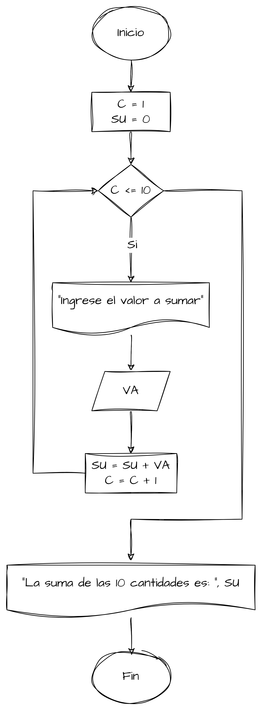
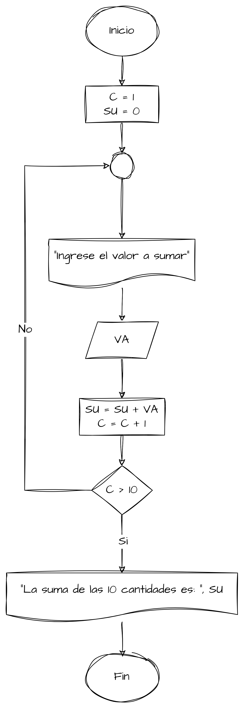
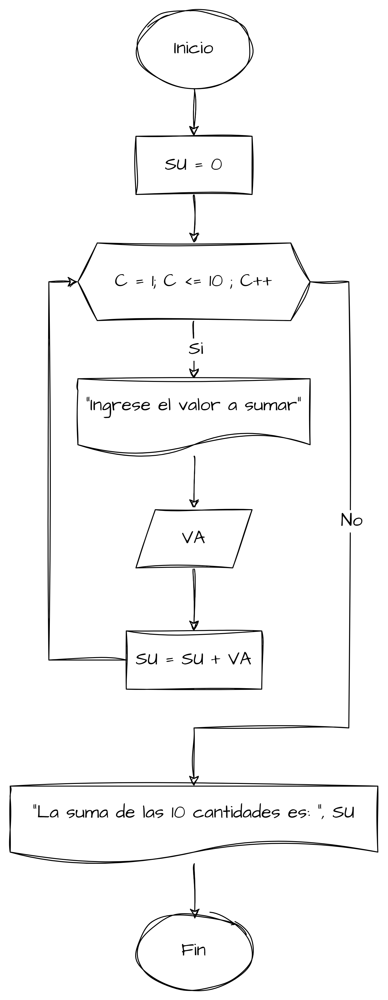

# Ejemplos de Bucles

## Ejercicio 1

Se requiere un algoritmo para obtener la suma de diez cantidades. Realice el diagrama de flujo y el pseudocódigo.

Con base en lo que se requiere determinar se puede establecer que las variables requeridas para la solución del problema
son las mostradas en la tabla:

| Variable | Tipo de Dato | Descripción     |
|----------|--------------|-----------------|
| `C`      | Entero       | Contador        |
| `VA`     | Real         | Valor por Sumar |
| `SU`     | Real         | Suma Acumulada  |

### Resolviendo con el ciclo Mientras

```text
Nombre del Algoritmo: Suma de 10 Cantidades
Definición de variables
    Entero: C
    Real: VA, SU
Algoritmo:
1. Inicio
2. Hacer C=1
3. Hacer SU=0
4. Mientras C<=10
    Inicio
        Escribir "Ingrese el valor a sumar"
        Leer VA
        Hacer SU=SU+VA
        Hacer C=C+1
    Fin
5. Escribir "La suma de las 10 cantidades es: ", SU
6. Fin
```



### Resolviendo con el ciclo Hasta Que

```text
Nombre del Algoritmo: Suma de 10 Cantidades
Definición de variables
    Entero: C
    Real: VA, SU
Algoritmo:
1. Inicio
2. Hacer C=1
3. Hacer SU=0
4. Hacer
    Inicio
        Escribir "Ingrese el valor a sumar"
        Leer VA
        Hacer SU=SU+VA
        Hacer C=C+1
    Fin
   Hasta Que C>10
5. Escribir "La suma de las 10 cantidades es: ", SU
6. Fin
```



### Resolviendo con el ciclo Para

```text
Nombre del Algoritmo: Suma de 10 Cantidades
Definición de variables
    Entero: C
    Real: VA, SU
Algoritmo:
1. Inicio
2. Hacer SU=0
3. Para C=1 Hasta 10 // [Opcional] Con Paso 1
    Inicio
        Escribir "Ingrese el valor a sumar"
        Leer VA
        Hacer SU=SU+VA
    Fin
4. Escribir "La suma de las 10 cantidades es: ", SU
5. Fin
```



De estas maneras es como se puede resolver el problema planteado, utilizando los diferentes tipos de ciclos que se
pueden encontrar en un lenguaje de programación.