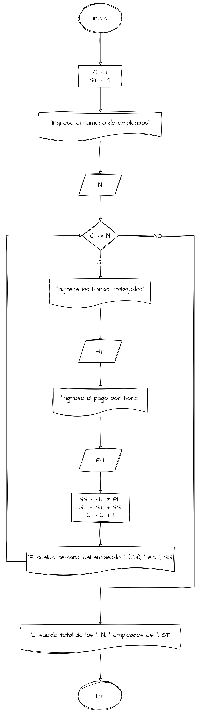

# Ejemplos de Bucles

## Ejercicio 1

Se requiere un algoritmo para obtener la suma de diez cantidades. Realice el diagrama de flujo y el pseudocódigo.

Con base en lo que se requiere determinar se puede establecer que las variables requeridas para la solución del problema
son las mostradas en la tabla:

| Variable | Tipo de Dato | Descripción     |
|----------|--------------|-----------------|
| `C`      | Entero       | Contador        |
| `VA`     | Real         | Valor por Sumar |
| `SU`     | Real         | Suma Acumulada  |

### Resolviendo con el ciclo Mientras

```text
Nombre del Algoritmo: Suma de 10 Cantidades
Definición de variables
    Entero: C
    Real: VA, SU
Algoritmo:
1. Inicio
2. Hacer C=1
3. Hacer SU=0
4. Mientras C<=10
    Inicio
        Escribir "Ingrese el valor a sumar"
        Leer VA
        Hacer SU=SU+VA
        Hacer C=C+1
    Fin
5. Escribir "La suma de las 10 cantidades es: ", SU
6. Fin
```


### Resolviendo con el ciclo Hasta Que

```text
Nombre del Algoritmo: Suma de 10 Cantidades
Definición de variables
    Entero: C
    Real: VA, SU
Algoritmo:
1. Inicio
2. Hacer C=1
3. Hacer SU=0
4. Hacer
    Inicio
        Escribir "Ingrese el valor a sumar"
        Leer VA
        Hacer SU=SU+VA
        Hacer C=C+1
    Fin
   Hasta Que C>10
5. Escribir "La suma de las 10 cantidades es: ", SU
6. Fin
```


### Resolviendo con el ciclo Para

```text
Nombre del Algoritmo: Suma de 10 Cantidades
Definición de variables
    Entero: C
    Real: VA, SU
Algoritmo:
1. Inicio
2. Hacer SU=0
3. Para C=1 Hasta 10 // [Opcional] Con Paso 1
    Inicio
        Escribir "Ingrese el valor a sumar"
        Leer VA
        Hacer SU=SU+VA
    Fin
4. Escribir "La suma de las 10 cantidades es: ", SU
5. Fin
```


De estas maneras es como se puede resolver el problema planteado, utilizando los diferentes tipos de ciclos que se
pueden encontrar en un lenguaje de programación.

## Ejercicio 2

Una empresa les paga a sus empleados con base en las horas trabajadas en
la semana. Realice un algoritmo para determinar el sueldo semanal de N
trabajadores y, además, calcule cuánto pagó la empresa por los N empleados.

Con base en lo que se requiere determinar se puede establecer que las variables requeridas para la solución del problema
son las mostradas en la tabla:

| Variable | Tipo de Dato | Descripción         |
|----------|--------------|---------------------|
| `N`      | Entero       | Número de Empleados |
| `HT`     | Real         | Horas Trabajadas    |
| `PH`     | Real         | Pago por Hora       |
| `SS`     | Real         | Sueldo Semanal      |
| `ST`     | Real         | Sueldo Total        |
| `C`      | Entero       | Contador            |

### Resolviendo con el ciclo Mientras 2

```text
Nombre del Algoritmo: Sueldo Semanal de N Trabajadores
Definición de variables
    Entero: N, C
    Real: HT, PH, SS, ST
Algoritmo:
1. Inicio
2. Hacer C=1
3. Hacer ST=0
4. Escribir "Ingrese el número de empleados"
5. Leer N
6. Mientras C<=N Entonces
    Inicio
        Escribir "Ingrese las horas trabajadas"
        Leer HT
        Escribir "Ingrese el pago por hora"
        Leer PH
        Hacer SS=HT*PH
        Hacer ST=ST+SS
        Escribir "El sueldo semanal del empleado ", C, " es: ", SS
        Hacer C=C+1
    Fin
7. Escribir "El sueldo total de los ", N, " empleados es: ", ST
8. Fin
```



### Resolviendo con el ciclo Hasta Que 2

```text
Nombre del Algoritmo: Sueldo Semanal de N Trabajadores
Definición de variables
    Entero: N, C
    Real: HT, PH, SS, ST
Algoritmo:
1. Inicio
2. Hacer C=1
3. Hacer ST=0
4. Escribir "Ingrese el número de empleados"    
5. Leer N
6. Hacer
    Inicio
        Escribir "Ingrese las horas trabajadas"
        Leer HT
        Escribir "Ingrese el pago por hora"
        Leer PH
        Hacer SS=HT*PH
        Hacer ST=ST+SS
        Escribir "El sueldo semanal del empleado ", C, " es: ", SS
        Hacer C=C+1
    Fin
   Hasta Que C>N
7. Escribir "El sueldo total de los ", N, " empleados es: ", ST
8. Fin
```

### Resolviendo con el ciclo Para 2

```text
Nombre del Algoritmo: Sueldo Semanal de N Trabajadores
Definición de variables
    Entero: N, C
    Real: HT, PH, SS, ST
Algoritmo:
1. Inicio
2. Hacer ST=0
3. Escribir "Ingrese el número de empleados"
4. Leer N
5. Para C=1 Hasta N Hacer // [Opcional] Con Paso 1
    Inicio
        Escribir "Ingrese las horas trabajadas"
        Leer HT
        Escribir "Ingrese el pago por hora"
        Leer PH
        Hacer SS=HT*PH
        Hacer ST=ST+SS
        Escribir "El sueldo semanal del empleado ", C, " es: ", SS
    Fin
6. Escribir "El sueldo total de los ", N, " empleados es: ", ST
7. Fin
```