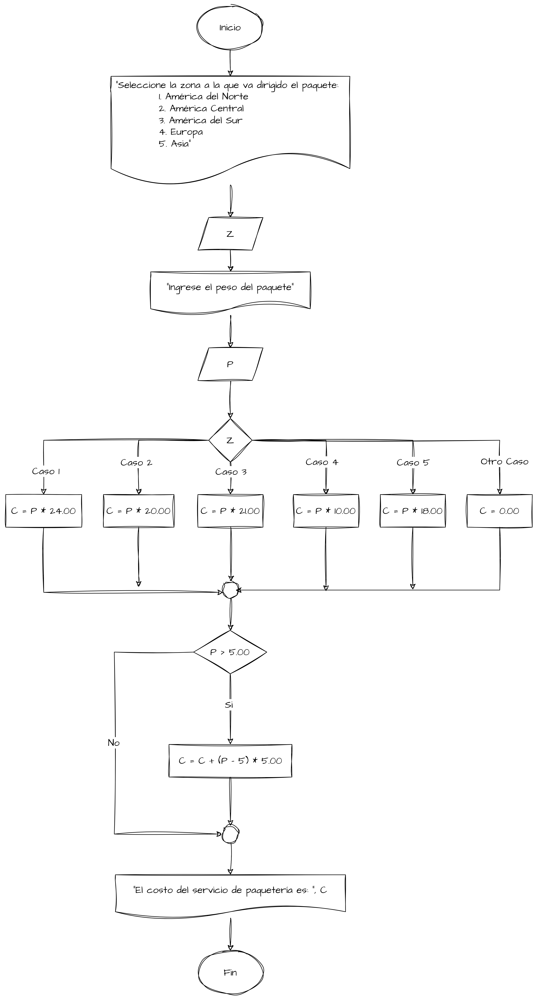

# Ejemplo de en caso de (switch)

## Caso 1

Una compañía de paquetería internacional tiene servicio en algunos países
de América del Norte, América Central, América del Sur, Europa y Asia. El
costo por el servicio de paquetería se basa en el peso del paquete y la zona a
la que va dirigido. Lo anterior se muestra en la tabla siguiente:

| Zona | Ubicación         | Costo por Kg |
|------|-------------------|--------------|
| 1    | América del Norte | 24.00        |
| 2    | América Central   | 20.00        |
| 3    | América del Sur   | 21.00        |
| 4    | Europa            | 10.00        |
| 5    | Asia              | 18.00        |

Se requiere un algoritmo para determinar cuánto se debe cobrar por el
servicio de paquetería, considerando que si el peso del paquete excede los
5 kg, se debe cobrar un costo adicional de 5.00 por cada kilo adicional.

### Definición de Variables

Para efectos del problema planteado se tiene lo siguiente:

| Variable | Descripción                | Tipo de Dato |
|----------|----------------------------|--------------|
| `Z`      | Zona a la que va dirigido. | `Entero`     |
| `P`      | Peso del paquete.          | `Real`       |
| `C`      | Costo del servicio.        | `Real`       |

### El Algoritmo

```text
Nombre del Algoritmo: CostoPaqueteria
Declaración de variables: 
    Entero: Z
    Real: P, C
Algoritmo:
1. Inicio
2. Escribir "Seleccione la zona a la que va dirigido el paquete:
            1. América del Norte
            2. América Central
            3. América del Sur
            4. Europa
            5. Asia"
3. Leer Z
    4. Escribir "Ingrese el peso del paquete"
5. Leer P
6. En caso de Z Hacer
        Caso 1
            Inicio
                Hacer C = P * 24.00
            Fin
        Caso 2
            Hacer C = P * 20.00
        Caso 3
            Inicio
                Hacer C = P * 21.00
            Fin
        Caso 4
            Inicio
                Hacer C = P * 10.00
            Fin
        Caso 5
            Inicio
                Hacer C = P * 18.00
            Fin
        Otro Caso
            Inicio
                Hacer C = 0.00
            Fin
7. Si P > 5 Entonces
        Hacer C = C + (P - 5) * 5.00
8. Escribir "El costo del servicio de paquetería es: ", C
9. Fin
```

### El diagrama de flujo

{display=block}

### Prueba del Algoritmo

Para probar el algoritmo se ingresan los siguientes datos:

* Zona: 3
* Peso del paquete: 7

Al ejecutar el algoritmo se obtiene lo siguiente:

```text
Seleccione la zona a la que va dirigido el paquete:
            1. América del Norte
            2. América Central
            3. América del Sur
            4. Europa
            5. Asia
3
Ingrese el peso del paquete
7
El costo del servicio de paquetería es: 147.00
```

